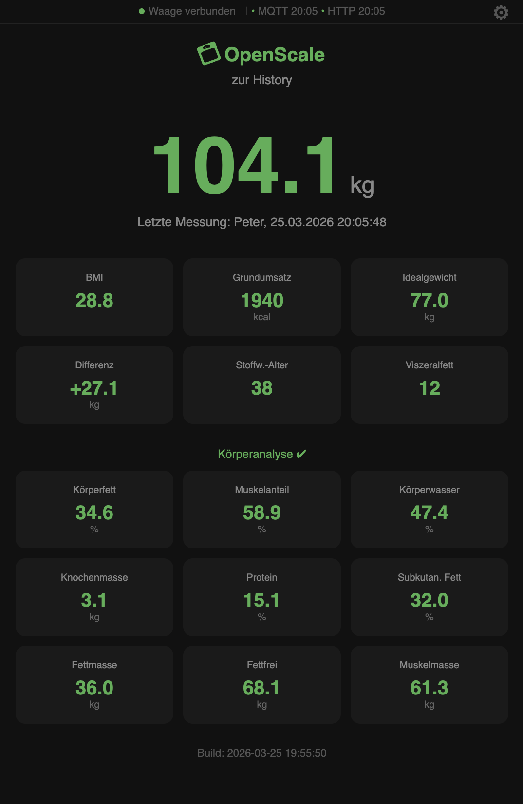
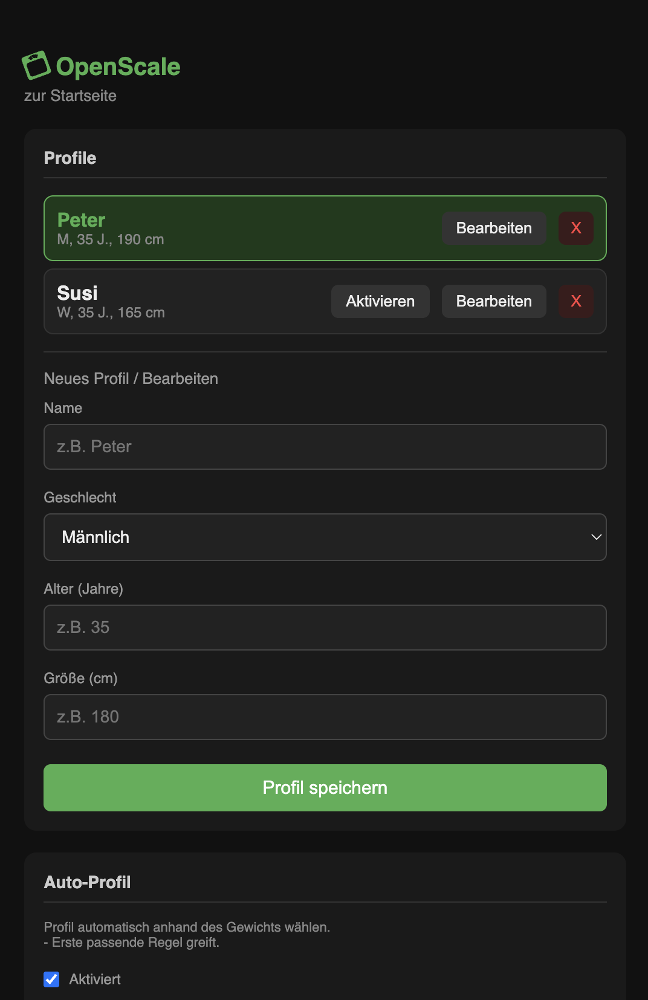
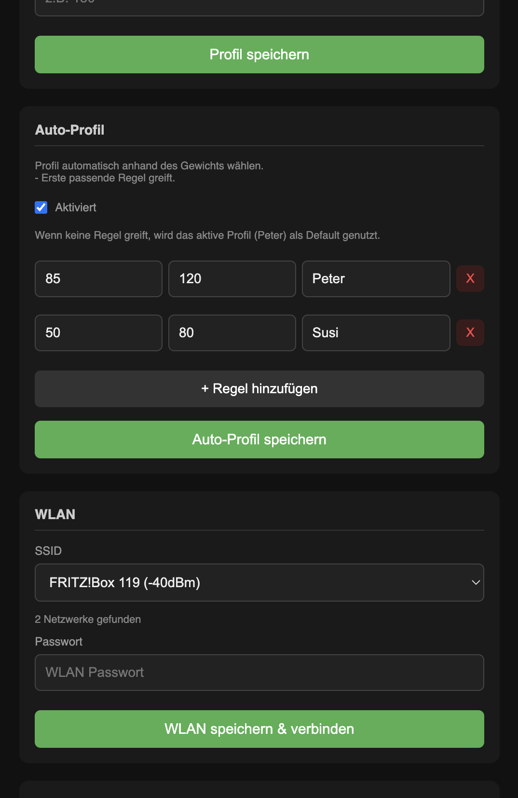
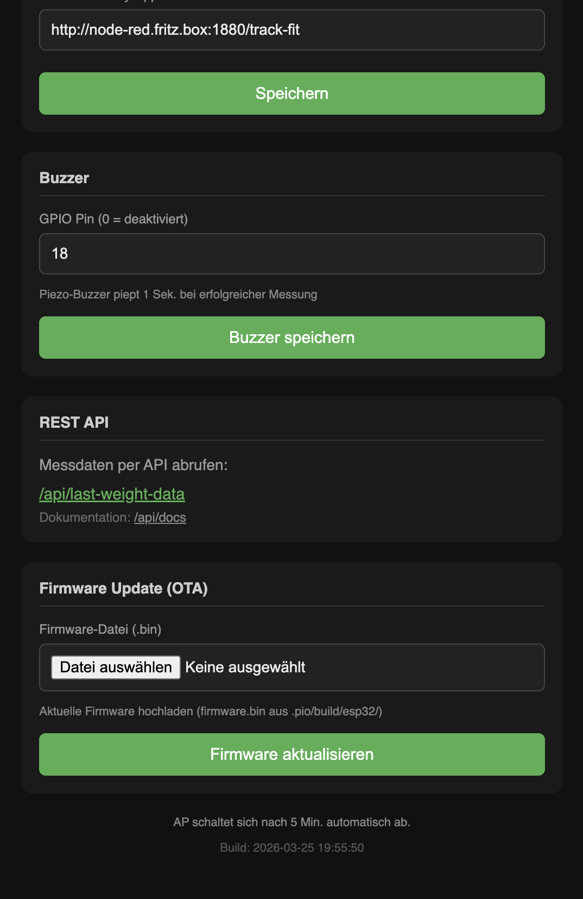

# OpenScale

ESP32-based bridge that reads weight data from a Bluetooth (BLE) body composition scale and makes it available via a local web interface, MQTT, and HTTP webhooks.

| Home | Settings 1 |
|:---:|:---:|
| Last Weight | Profiles |
|  |  |

| Settings 2 | Settings 3 |
|:---:|:---:|
| Auto Profil | OTA Update |
|  |  |

## Supported Hardware

| ESP32-WROOM-32 | FitTrack Dara Scale |
|:---:|:---:|
|  |  |

- **Microcontroller**: ESP32-WROOM-32 (any ESP32 dev board)

### Compatible Scales

OpenScale works with BLE body composition scales that use the **ElinkThings/SWAN platform** (BLE service `0xFFB0`). Many affordable smart scales from different brands share this common hardware and protocol — they are manufactured by the same OEM in China and sold under various names.

**Tested:**
- FitTrack Dara (Model: FT-DARA-WH01-GL) — BLE chip: Dialog Semi DA14531

**Expected to work** (same platform, untested):
- GAIAM Smart Weight Scale
- MGB / Icomon scales (SWAN protocol)
- Other scales advertising as `"FitTrack"` via BLE

> If your scale uses BLE service `0xFFB0` with characteristics `FFB1`/`FFB2`/`FFB3`, it likely works. You may need to adjust the `SCALE_NAME` constant in `src/main.cpp` to match your scale's BLE advertised name.

## Features

- Automatic BLE connection to scale when someone steps on it
- Last measurement displayed on a responsive web page with body composition tiles and toast notification on update
- **Body composition analysis**: BMI, body fat %, muscle mass, water %, bone mass, BMR, protein %, metabolic age, visceral fat, and more — calculated from weight + impedance + user profile
- **BIA impedance detection**: Automatic barefoot/socks detection — full body analysis when barefoot, basic metrics when wearing socks
- **Multi-profile support**: Create up to 8 user profiles (name, gender, age, height) — active profile shown on home page
- WiFi configuration via captive portal with SSID scan (no hardcoded credentials)
- MQTT publishing of full body composition data to any broker
- HTTP POST webhook forwarding with all measurement data
- Settings page for profiles, WiFi, MQTT, and HTTP webhook configuration
- REST API for external systems to poll measurement data
- NTP time sync (CET/CEST timezone)
- Auto-reconnect after scale powers off
- mDNS support (`http://openscale.local`)

## Architecture


## Getting Started

### Prerequisites

- [PlatformIO](https://platformio.org/) (CLI or IDE plugin)
- ESP32 dev board connected via USB

### Build & Flash

```bash
pio run -t upload
```

### Serial Monitor

```bash
pio device monitor
```

> **Note**: Close the serial monitor before flashing, otherwise the upload will fail.

### Initial WiFi Setup

1. On first boot, the ESP32 creates a WiFi access point:
   - **SSID**: `OpenScale`
   - **Password**: `12345678`
2. Connect to the AP and open `http://192.168.4.1`
3. Select your home WiFi network from the scan list (or enter manually) and enter the password
4. The ESP32 tests the connection and shows success or failure
5. On success, the ESP32 restarts and joins your network

### Usage

1. Open `http://openscale.local` (or the IP shown in the serial log)
2. Step on the scale **barefoot** — the weight measurement begins automatically
3. The final weight, body composition, and timestamp are displayed after the measurement stabilizes
4. A toast notification appears when new data arrives

> **Tip**: For full body composition analysis (body fat, muscle mass, water, etc.), step on the scale barefoot. With socks, only basic metrics (BMI, BMR, metabolic age) are available.

### Settings

Navigate to `/setup` to configure:

- **Profile** — User profiles with name, gender, age, height (select active profile)
- **WLAN** — WiFi credentials (triggers reconnect)
- **MQTT** — Broker, port, topic, user/password (saved inline, no reconnect)
- **HTTP Webhook** — POST URL for weight data forwarding (saved inline)

### REST API

| Endpoint | Description |
|----------|-------------|
| `GET /api/last-weight-data` | Last measurement with body composition (JSON) |
| `GET /api/settings` | Current settings and profiles |
| `GET /api/docs` | API documentation |

Example response (barefoot measurement):
```json
{
  "weight": 102.1,
  "time": "22.03.2026 20:30:45",
  "profile": "Peter",
  "impedance": 592,
  "body_analysis": true,
  "bmi": 28.3,
  "bmr": 2038,
  "metabolic_age": 39,
  "visceral_fat": 11,
  "ideal_weight": 79.4,
  "weight_control": 22.7,
  "body_fat_pct": 32.0,
  "muscle_pct": 61.2,
  "water_pct": 49.6,
  "bone_mass": 3.1,
  "protein_pct": 15.6,
  "protein_mass": 16.0,
  "subcutaneous_fat_pct": 27.6,
  "fat_mass": 32.7,
  "fat_free_weight": 69.4,
  "muscle_mass": 62.5
}
```

## Serial Output

```
=== OpenScale ===
Mode:  LAN (Station)
IP:    192.168.1.42
mDNS:  http://openscale.local
-----------------------------
FitTrack found!
Connecting to 03:b3:ec:c1:cf:24...
Connected. Waiting for measurement...
..................
>>> FINAL WEIGHT: 102.1 kg <<<
>>> IMPEDANCE: 592 ohms <<<
  Using BIA impedance: 592 ohms
--- Body Composition ---
  Impedance:      592 ohms
  BMI:            28.3
  Body Fat:       32.0 %
  Muscle:         61.2 % (62.5 kg)
  Water:          49.6 %
  Bone Mass:      3.1 kg
  BMR:            2038 kcal
  Protein:        15.6 % (16.0 kg)
  Metabolic Age:  39
  Visceral Fat:   11
  Subcut. Fat:    27.6 %
  Fat Mass:       32.7 kg
  Fat-Free:       69.4 kg
  Ideal Weight:   79.4 kg
  Weight Control: 22.7 kg
------------------------
MQTT published to openscale/weight
HTTP POST https://example.com/webhook -> 200
>> Scale disconnected. Rescanning...
```

## WiFi Behavior

| Situation | Behavior |
|-----------|----------|
| First boot (no saved WiFi) | Starts AP mode for configuration |
| Saved WiFi available | Connects to WiFi (STA mode) |
| WiFi lost for >60 seconds | Falls back to AP mode for 5 minutes |
| AP mode timeout (5 min) | Retries saved WiFi credentials |

## Development

This project was predominantly built using [Claude Code](https://claude.ai/claude-code) (AI-assisted development).

## License

MIT
